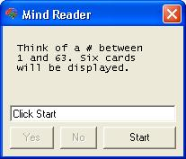



## Mind Reader \- Guesses Your Number \- Between 1 &amp; 63

### Description

You think of a number between 1 and 63. It will show you 6 cards. If your number is on the card click Yes. Otherwise, click No. At the end it will guess your number. **Update: Now added a Card List Generator for any number of cards. Idea for this by Listeris. Please vote for my code. **Update: Now added a menu button that will show you why it returned the number that it did. I did this by modifying the Card List Generator.
 
### More Info
 
Some Credit goes to...

Lefteris

             |
---                |---
**Submitted On**   |2007-02-02 19:56:10
**By**             |[Matt DeKok](https://github.com/Planet-Source-Code/PSCIndex/blob/master/ByAuthor/matt-dekok.md)
**Level**          |Beginner
**User Rating**    |4.3 (13 globes from 3 users)
**Compatibility**  |VB 6\.0
**Category**       |[Games](https://github.com/Planet-Source-Code/PSCIndex/blob/master/ByCategory/games__1-38.md)
**World**          |[Visual Basic](https://github.com/Planet-Source-Code/PSCIndex/blob/master/ByWorld/visual-basic.md)
**Archive File**   |[Mind\_Reade204600222007\.zip](https://github.com/Planet-Source-Code/matt-dekok-mind-reader-guesses-your-number-between-1-amp-63__1-64293/archive/master.zip)

